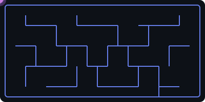

  <div align="center">

  <!-- 🎄 Festive Gradient Header with 3D Effect -->
  

  <!-- Glitch Effect Name -->
  

  <br/>

  <!-- Animated Status Badges -->
  
  
  

  <br/><br/>

  <!-- Profile Counter with Style -->
  <a href="https://github.com/RakshitOP">
    
  </a>

  <br/><br/>

  <!-- Social Links - Sleek Pills -->
  <a href="https://rakshit-codes.netlify.app"></a>
  <a href="https://linkedin.com/in/rakshit-gajera"></a>
  <a href="https://instagram.com/rakshit__gajera"></a>
  <a href="mailto:rakshit.vibecodes@gmail.com"></a>

  </div>

  

  <br/>

## 🧬 `npm install @dev/rakshit --save`

```javascript
const rakshit = {
  name: "Rakshit Gajera",
  title: "Full Stack Developer & Digital Craftsman",
  location: "India 🇮🇳",
  
  expertise: {
    frontend: ["React", "Next.js", "TypeScript", "Three.js"],
    backend: ["Node.js", "Express", "NestJS", "Python"],
    philosophy: "Clean code is not written by following rules. It's written by obsessing over quality."
  },
  
  currentlyBuilding: [
    "Scalable web applications that users love",
    "Interactive experiences that leave impressions",
    "Solutions that solve real-world problems"
  ],
  
  achievements: {
    googleRank: "#1 for 'Rakshit Gajera' 🏆",
    projectsDelivered: "10+",
    coffeeConsumed: "∞ cups ☕"
  },
  
  lifePhilosophy: [
    "🎯 Ship fast, iterate faster",
    "🧠 Learn something new every single day",
    "🤝 Collaborate > Compete",
    "✨ Attention to detail is everything"
  ],
  
  funFact: "I debug with strategic console.logs and zero regrets 🎭"
};

export default rakshit;
```

  <br/>

  

  ## ⚔️ Weapons of Mass Creation

  <div align="center">

  <table>
  <tr>
  <td align="center" width="25%">

  ### 💻 Programming Languages
  
  
  
  <br/>
  <sub>*Speaking in tongues*</sub>

  </td>
  <td align="center" width="25%">

  ### 📚 Libraries
  
  
  
  <br/>
  <sub>*Building blocks of magic*</sub>

  </td>
  <td align="center" width="25%">

  ### 🚀 Frameworks
  
  
  <br/>
  <sub>*Powerhouses of productivity*</sub>

  </td>
  <td align="center" width="25%">

  ### 🛠️ Developer Tools
  
  
  
  <br/>
  <sub>*Tools of the trade*</sub>

  </td>
  </tr>
  </table>

  </div>

  <br/>

  

## 🚀 Featured Projects

<div align="center">

<br/>

<!-- PROJECT 1: PORTFOLIO -->

<a href="https://rakshit-codes.netlify.app">

</a>

<p>


</p>

<a href="https://rakshit-codes.netlify.app"></a>

<br/><br/><br/>

<!-- PROJECT 2: E-COMMERCE -->

<a href="https://flipcart-fakestore.netlify.app">

</a>

<p>


</p>

<a href="https://flipcart-fakestore.netlify.app"></a>

<br/><br/><br/>

<!-- PROJECT 3: ATTENDANCE TRACKER -->

<a href="https://du-attendance.pages.dev">

</a>

<p>


</p>

<a href="https://du-attendance.pages.dev"></a>

<br/><br/><br/>

<!-- PROJECT 4: IMDB CLONE -->

<a href="https://imdbpro-clone.netlify.app">

</a>

<p>


</p>

<a href="https://imdbpro-clone.netlify.app"></a>

<br/><br/><br/>

<!-- PROJECT 5: INVOICE GENERATOR -->

<a href="https://theinvoicegenerator.netlify.app">

</a>

<p>


</p>

<a hr ef="https://theinvoicegenerator.netlify.app"></a>

<br/><br/>

</div>

  <br/>

  

  ## 📊 The Numbers Game

  <div align="center">

  <!-- Stats Grid -->
  
  

  <br/>

  <!-- Languages Card with Custom Layout -->
  

  </div>

  <br/>

  

  ## 📈 Code Heartbeat

  <div align="center">

  

  </div>

  <br/>

  

  ## 🎮 Let's Play!

  <div align="center">

  <!-- Animated Maze -->
  

  <br/><br/>

  <!-- Spotify Currently Playing (You can set this up) -->
  

  </div>

  <br/>

  

  ## 🤝 Let's Build Something Epic!

  <div align="center">

  

  <br/>

  <!-- Contact Cards -->
  <table>
  <tr>
  <td align="center">
  <a href="https://rakshit-codes.netlify.app">
  
  </a>
  </td>
  <td align="center">
  <a href="https://linkedin.com/in/rakshit-gajera">
  
  </a>
  </td>
  <td align="center">
  <a href="https://instagram.com/rakshit__gajera">
  
  </a>
  </td>
  <td align="center">
  <a href="mailto:rakshit.vibecodes@gmail.com">
  
  </a>
  </td>
  </tr>
  </table>

  <br/>

  <!-- Random Dev Quote -->
  

  <br/><br/>

  <!-- Fun Metrics -->
  
  
  
  

  </div>

  <br/>

  <!-- Cool Footer -->
  

  <div align="center">

  

  <br/>

  **`< Built with 💜 and mass amounts of caffeine />`**

  

  </div>
